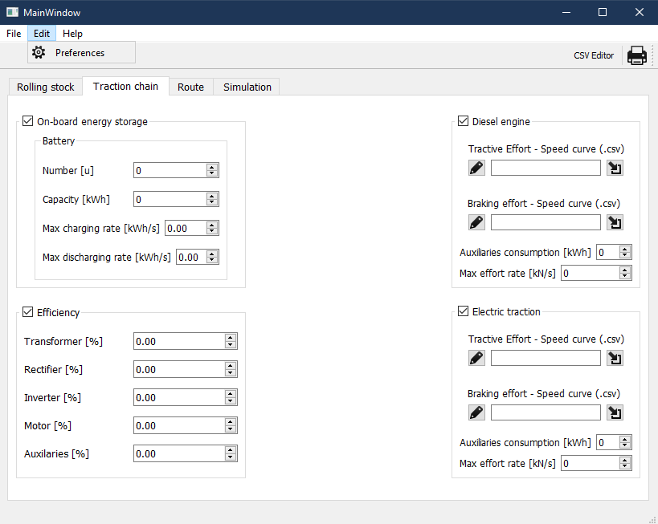
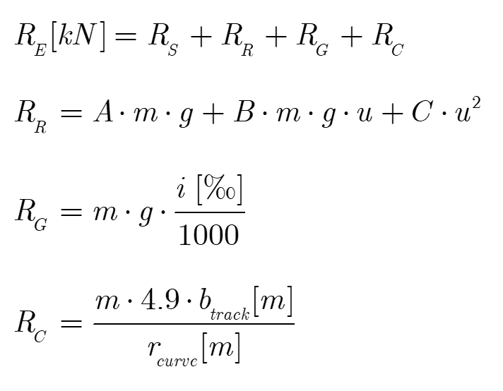

# <b> WIP</b>
# RailwaySim

#### Table of contents  <!-- omit in toc -->

- [RailwaySim](#railwaysim)
  - [Implemented functionality](#implemented-functionality)
    - [Rolling stock resistances](#rolling-stock-resistances)
  - [Installation](#installation)
  - [Capabilities](#capabilities)
  - [Usage](#usage)
    - [Solvers:](#solvers)
  - [Results](#results)

A deterministic simulation tool to perform time-driven railway route simulations. 
## Implemented functionality

### Rolling stock resistances

where <i>m</i> is the total mass in tonnes, <i>u</i> is speed in km/h and <i>g</i> is gravity in m/s2. <i>RS</i> is the starting resistance, introduced manually as deemed fit for the system. Rolling resistance <i>RR</i> is given by the Davis formula with coefficients <i>A</i>, <i>B</i> and <i>C</i>, which depend on the particular vehicle. Resistance due to grade, <i>RG</i>, is dependent on the track slope. Finally, <i>RC</i> is given by the empirical Desdovits formula and is passed the current curve radius and track gauge.       
## Installation

## Capabilities

Test

## Usage
### Solvers:
1. Minimize operation time: normally used as a benchmark. Yields the fastest driving strategy possible with the given constraints.
2. Minimize energy consumption: TODO
3. Fixed travel time: TODO
## Results

Test

