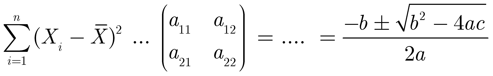

# RailwaySim

#### Table of contents  <!-- omit in toc -->

- [RailwaySim](#railwaysim)
  - [Capabilities](#capabilities)
  - [Usage](#usage)
  - [Results](#results)

A deterministic simulation tool to perform continuous dynamic railway route simulations.

## Capabilities

Test

## Usage

Test

## Results

Test

