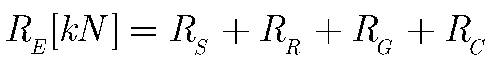

# RailwaySim

#### Table of contents  <!-- omit in toc -->

- [RailwaySim](#railwaysim)
  - [Implemented functionality](#implemented-functionality)
    - [Rolling stock resistance](#rolling-stock-resistance)
  - [Installation](#installation)
  - [Capabilities](#capabilities)
  - [Usage](#usage)
  - [Results](#results)

A deterministic simulation tool to perform time-driven railway route simulations. 
## Implemented functionality

### Rolling stock resistance

## Installation

## Capabilities

Test

## Usage

Test

## Results

Test

