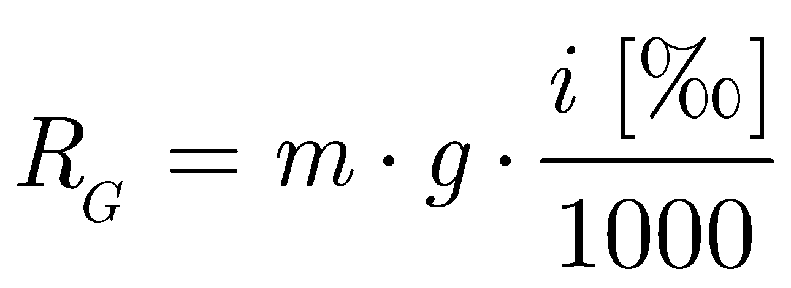
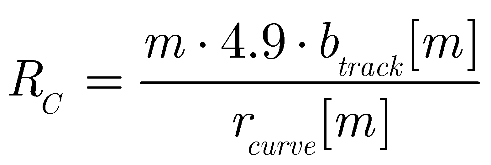
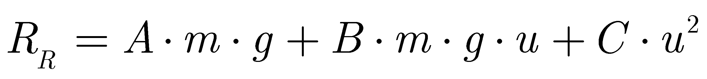

# RailwaySim

#### Table of contents  <!-- omit in toc -->

- [RailwaySim](#railwaysim)
  - [Implemented functionality](#implemented-functionality)
    - [Rolling stock resistance](#rolling-stock-resistance)
  - [Installation](#installation)
  - [Capabilities](#capabilities)
  - [Usage](#usage)
  - [Results](#results)

A deterministic simulation tool to perform time-driven railway route simulations. 
## Implemented functionality

### Rolling stock resistance

 \
 \
\

where <i>m</i> is the mass in tonnes and <i>g</i> is gravity in m/s2. <i>RS</i> is the starting resistance, introduced manually.
## Installation

## Capabilities

Test

## Usage

Test

## Results

Test

