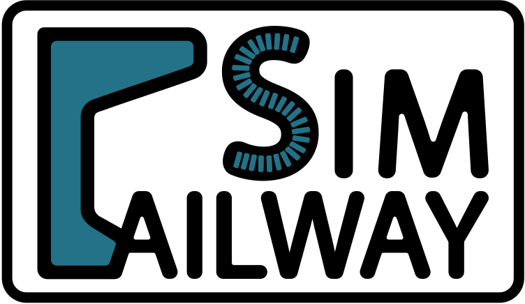

   
  
  
  
   

#### Table of contents  <!-- omit in toc -->
- [RailwaySim](#railwaysim)
  - [Development](#development)
      - [Requirements](#requirements)
  - [Features](#features)
      - [Virtual speed calculation](#virtual-speed-calculation)
      - [Rolling stock resistance](#rolling-stock-resistance)
  - [Installation](#installation)
  - [Usage](#usage)
    - [Solvers](#solvers)
  - [Results](#results)

<b>WIP</b>

# RailwaySim
A deterministic tool to perform railway route simulations. 

## Development

#### Requirements
- `Python +3.8`
- `pip3`
- `PyQt5` (for full PyInstaller support)
- `pipenv` (recommended)
- Packages inside `pipfile`. They will be installed in the virtual environment with `pipenv install`.

To get started:
1. Clone the repo: `git clone https://github.com/danicc097/RailwaySim.git`
2. Install the required packages and corresponding versions with `pipenv install`
3. Run the main program file with `pipenv run python main.py`
4. If any changes are made to the `.ui` files, convert them later to python with `ui_to_py.ps1` or `ui_to_py.sh`.
5. To distribute using `PyInstaller`, the project can be easily built with `build-windows.ps1` or `build-linux.sh` after activating a virtual environment.

## Features

#### Virtual speed calculation

To ensure that the rolling stock complies with the predefined track speed limits at all points, it is necessary to take its total length into account. In a nutshell, this algorithm will offset the original speed limit by the train length when a target is encountered, <i>i.e.</i> when the next speed is higher than the preceding one, splitting the original array while preserving the rest of the track's parameters (grade, curve radius, etc.). The simulation point is set to be in the front of the train for further calculations.

Train length is equally essential to determine the average grade to which the system is subjected, instead of using the front car as only reference. A far more accurate equivalent grade can be obtained based on train length and weighing one grade step backwards at a time up until the total length is reached. Curve resistance is however independent of train length and calculated based on the current simulation point.

To determine the actual braking curve, whenever any intersection is found (A) between the powering/cruising and braking matrices, the remaining curve that follows is appended.

#### Rolling stock resistance
Total resistance effort is currently computed based on the following set of formulas. Custom formulas defined by the user with a given set of variables may be implemented in the future.

where <i>m</i> is the total mass in tonnes, <i>u</i> is speed in km/h and <i>g</i> is gravity in m/s2. <i>RS</i> is the starting resistance, introduced manually as deemed fit for the system. Rolling resistance <i>RR</i> is given by the Davis formula with coefficients <i>A</i>, <i>B</i> and <i>C</i>, which depend on the particular vehicle. Resistance due to grade, <i>RG</i>, is dependent on the track slope. Finally, <i>RC</i> is given by the empirical Desdovits formula and is passed the current curve radius and track gauge. 

## Installation

Simply launch the whole package from the executable for your system. Currently built and tested in both Windows 10 and Ubuntu 18.04 via WSL.

## Usage

<b>WIP</b>

RailwaySim supports passenger and freight trains. The desired option must be selected before running the simulation. This eases the end user's input of many rolling stock constants and will allow for more flexibility in the use of custom formulas for many parameters in the future.

Templates for route and effort data are provided, which may be filled following the specified units and with **dot-decimal notation**. Complete examples are also provided for reference.

Two critical parameters to allow for a reasonable result are distance steps for both braking and powering computations. Setting them to `1.0 m` will yield accurate and very fast results. For reference, an i5-6600 will take 10 seconds to simulate a 400.000 m route.

### Solvers
As of now, unless the project gains some <i>traction</i>, the only available solver is `1`. Any contribution/suggestion is welcome.

1. <i>Minimize operation time</i>: normally used as a benchmark. Yields the fastest driving strategy possible with the given constraints.
2. <i>Minimize energy consumption</i>: -
3. <i>Fixed travel time</i>: -

## Results

An output CSV file is saved with relevant results to represent the unit's performance to the selected location, easily imported into the user's most preferred visualization software or ready to analyze in the beautifully integrated GUI's canvas.

